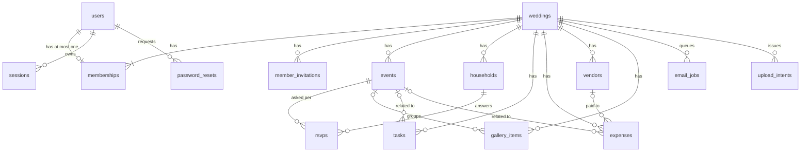

# The Wedding Home — database design

**Product:** The Wedding Home — the operating system for Indian marriages  
**Version:** 1.0 (draft for review)  
**Date:** 30 Sep 2026  
**Audience:** Anyone writing a Mongoose model, a repository, or a migration

This document turns the rules in [ARCHITECTURE.md](./ARCHITECTURE.md) and the objects in [PRD.md](./PRD.md) into collections, fields, indexes, and integrity rules. It adds no pages, roles, or features. Where the PRD or architecture was silent or wrong, §12 lists the call made here, so it can be reopened.

| Artifact | Job |
|---|---|
| [PRD.md](./PRD.md) | What each object is, in product words |
| [ARCHITECTURE.md](./ARCHITECTURE.md) | Tenancy, transactions, uploads, jobs |
| This file | Collections, fields, indexes, integrity, retention |
| [API.md](./API.md) | How the outside world reads and writes these collections |

---

## 1. Scope and targets

MongoDB Atlas in Mumbai, Mongoose 8, one database per environment (`wedding-home-dev`, `wedding-home`).

Design ceiling per wedding (from the architecture): about 1,000 households, 5,000 gallery items, and a few thousand weddings in total. The numbers in §10 show that this is small for MongoDB. The schema stays simple for that reason. There is no sharding key, no caching layer, and no precomputed counters except one (`adminCount`, §5.4).

Founding rules, repeated because every choice below follows from them:

1. **The wedding is the tenant.** Every wedding-owned document carries `weddingId`, and every index on such a collection starts with it.
2. **Embed what is small, bounded, and read together. Reference what can grow.** Households, RSVPs, tasks, expenses, vendors, and gallery items are never embedded in a wedding.
3. **The database refuses what it can refuse cheaply** (unique indexes, required fields, enums). **The service refuses the rest** (same-wedding references, last Admin, attending count). Neither replaces the other.

---

## 2. Conventions

| Topic | Rule |
|---|---|
| Collection names | `snake_case`, plural |
| Field names | `camelCase` |
| `_id` | `ObjectId`. Generated by the driver. Time-ordered, so it doubles as the cursor for gallery pagination |
| Timestamps | `createdAt`, `updatedAt` as UTC `Date`, from Mongoose `timestamps: true` |
| Civil dates | A date with no time (wedding date, task due date, expense date) is a string `YYYY-MM-DD` meaning that day in `Asia/Kolkata`. Never a `Date` at midnight, which shifts by a day depending on who reads it |
| Instants | An event start, end, or muhurat is a UTC `Date`. Screens convert to `Asia/Kolkata` |
| Money | Integer **rupees**, field suffix `Inr` (`amountInr`, `agreedCostInr`). No floats. A paise column is not needed for a spend log, and can be added later as `amountPaise` without breaking the meaning of the old field |
| Enums | Lowercase snake strings (`non_veg`, not `NonVeg`) in storage. Enum lists live in one shared TypeScript module used by Zod and Mongoose |
| Booleans | Named as facts: `published`, `hidden`, `isPrimary`. Default `false` unless stated |
| Optional fields | Absent, not `null`. Mongoose `minimize` stays on. The API accepts `null` to clear a field and the service `$unset`s it |
| Emails | Trimmed and lowercased before storing. Unique on the lowercased value |
| Phones | E.164 (`+919876543210`). The UI accepts local forms and normalises. `wa.me` needs the digits without `+` |
| Tokens | 32 random bytes from a CSPRNG, base64url, 43 characters |
| Search text | A `nameSearch` field holds the lowercased, accent-folded name so prefix search uses an index |
| Versioning | Every document has `schemaVersion: 1`. Bump it when a document shape changes, and migrate lazily or by script (MongoDB's schema versioning pattern) |
| Foreign keys | Plain `ObjectId` fields, named `xxxId`. MongoDB does not enforce them, the services do (§7) |
| Unknown fields | Mongoose `strict: true`. Extra fields are dropped, not stored |

### Shared value shapes

```text
CivilDate   "2027-02-14"

MediaRef    { key, contentType, bytes }         S3 object in our bucket. key starts with weddings/{weddingId}/

Place       { name?, address, city, googlePlaceId?,
              location: { type: "Point", coordinates: [lng, lat] } }
            GeoJSON order is longitude first. The API speaks { lat, lng } and the
            repository converts both ways so no other code touches the order.

Diet        { veg, nonVeg, jain, noOnionGarlic }   four integers >= 0

ThemeOverride   a partial ThemeTokens object as defined in the indian-wedding-themes skill.
                Media fields hold a MediaRef, not a URL. URLs are signed at render time.
```

### Per-wedding limits

Starting values. They stop one account filling the database and can be raised by configuration. They are enforced in services and returned as `CONFLICT` with reason `LIMIT_REACHED`.

| Thing | Limit |
|---|---|
| Members | 30 |
| Pending member invitations | 30 |
| Events | 30 |
| Households | 2,000 |
| Tasks | 2,000 |
| Expenses | 10,000 |
| Saved vendors | 300 |
| Gallery items | 10,000 |
| Aashirwad entries | 40 |

### Text limits

| Field kind | Limit |
|---|---|
| Person or household name | 1–100 |
| Wedding title, event title | 1–120 |
| City | 1–80 |
| Address | 1–300 |
| Venue name | 1–120 |
| Story, task description | 2,000 |
| Stay list | 1,500 |
| Event description ("what this function is") | 600 |
| Dress note, how to reach, parking | 300 each |
| Notes (household, vendor, expense) | 1,000 |
| Aashirwad message | 400 |
| Family blurb | 600 |

---

## 3. Collections at a glance



`rate_limits` has no relations. It is a counter store.

| # | Collection | Belongs to a wedding | Grows with |
|---|---|---|---|
| 1 | `users` | No | People |
| 2 | `sessions` | No | Logins (expire) |
| 3 | `password_resets` | No | Reset requests (expire) |
| 4 | `weddings` | It is the tenant | Weddings |
| 5 | `memberships` | Yes | Organisers |
| 6 | `member_invitations` | Yes | Invites sent |
| 7 | `events` | Yes | Functions (≤ 30) |
| 8 | `households` | Yes | Guests (~1,000) |
| 9 | `rsvps` | Yes | Households × functions (~8,000) |
| 10 | `tasks` | Yes | Tasks |
| 11 | `expenses` | Yes | Bills |
| 12 | `vendors` | Yes | Saved vendors |
| 13 | `gallery_items` | Yes | Uploads (~5,000) |
| 14 | `email_jobs` | Yes | Bulk and scheduled sends |
| 15 | `upload_intents` | Yes | Uploads in flight (expire) |
| 16 | `rate_limits` | No | Requests (expire) |

The architecture listed 15 working collections. `upload_intents` is new (§5.15) and is the only addition, which makes 16.

---

## 4. Embed or reference

| Data | Choice | Why |
|---|---|---|
| Public-site content (`site`), gallery settings, helplines, two families, theme choice | **Embedded in `weddings`** | Bounded, read on every public page, edited by Admins as one form |
| Aashirwad entries | **Embedded array in `weddings.site`**, capped at 40 | Small, family-written, always read with the site. The cap is what makes an array safe here |
| Venue and place | **Embedded in `events`** | One per event, never queried on its own |
| Households' invited events | **Array of ids on `households`**, ≤ 30 | Bounded by the event cap. Read with the household. Multikey index answers "who is invited to Sangeet" |
| RSVPs | **Own collection** | One per household per function. Counted and summed per function. Would be ~8,000 subdocuments if embedded |
| Diet headcounts | **Embedded object on `rsvps`** | Four integers, always read and summed together |
| Tasks, expenses, vendors, gallery items | **Own collections** | Unbounded and filtered independently |
| Vendor ↔ event links | **Array of ids on `vendors`** | Bounded by the event cap |
| Role and wedding of a user | **`memberships` row**, not on `users` | The membership is the proof of access (architecture §10). Removing a member deletes one row and leaves the account |

---

## 5. Collections

Field tables use `req` = required on insert. Indexes are written as `{ field: 1 }` for ascending. Every index listed is created by a script (§11), not by Mongoose at runtime.

### 5.1 `users`

| Field | Type | Req | Notes |
|---|---|---|---|
| `name` | string | yes | 1–100 |
| `email` | string | yes | Lowercased. Unique |
| `passwordHash` | string | yes | Argon2id string (parameters live inside it) or bcrypt. Never returned by any query that is not login |
| `passwordChangedAt` | Date | no | Sessions created before it are dead |
| `schemaVersion`, `createdAt`, `updatedAt` | | yes | |

Indexes: `{ email: 1 }` **unique**.

A user has no `role` and no `weddingId`. Both come from `memberships`.

### 5.2 `sessions`

| Field | Type | Req | Notes |
|---|---|---|---|
| `tokenHash` | string | yes | SHA-256 hex of the cookie value. The cookie value is 32 random bytes and is never stored |
| `userId` | ObjectId | yes | |
| `createdAt` | Date | yes | |
| `expiresAt` | Date | yes | 30 days from the last renewal, never later than `createdAt` + 90 days |
| `lastSeenAt` | Date | yes | Updated at most once a day. If less than 15 days remain, the same write extends `expiresAt` |

Indexes:
- `{ tokenHash: 1 }` **unique**
- `{ expiresAt: 1 }` **TTL**, `expireAfterSeconds: 0`
- `{ userId: 1 }` for "delete all sessions of this user" (logout everywhere, password change, reset)

A fast hash is correct here: the input is 256 random bits, so there is nothing to brute-force. A slow password hash would only make every request slower.

### 5.3 `password_resets`

| Field | Type | Req | Notes |
|---|---|---|---|
| `tokenHash` | string | yes | SHA-256 hex |
| `userId` | ObjectId | yes | |
| `expiresAt` | Date | yes | 1 hour |
| `usedAt` | Date | no | Set when the token is spent. Spending is `findOneAndUpdate` where `usedAt` is absent and `expiresAt > now`, so two clicks cannot both succeed |

Indexes: `{ tokenHash: 1 }` **unique**; `{ expiresAt: 1 }` **TTL** (`expireAfterSeconds: 0`); `{ userId: 1 }`.

A new request for the same user removes that user's older unspent tokens.

### 5.4 `weddings`

The tenant. The document is bounded (well under 100 KB).

| Field | Type | Req | Notes |
|---|---|---|---|
| `brideName`, `groomName` | string | yes | 1–100 |
| `title` | string | no | Overrides "Bride & Groom" on the site |
| `weddingDate` | CivilDate | yes | The countdown target until a primary event overrides it |
| `city` | string | yes | |
| `story` | string | no | 2,000 |
| `cover` | MediaRef | no | |
| `adminCount` | int | yes | Number of Admin memberships. Always ≥ 1 (see below) |
| `createdBy` | ObjectId | yes | The first Admin |
| `site` | object | yes | Public site content and settings. Admin-only to write. See below |
| `gallery` | object | yes | See below |

`site`:

| Field | Type | Notes |
|---|---|---|
| `slug` | string | Absent until an Admin sets it. `[a-z0-9]` and single hyphens, 3–48 characters. Unique across weddings |
| `published` | bool | Public site is served only when true and a slug exists |
| `publishedAt` | Date | First publish |
| `liveUrl` | string | `https` URL on an allow-listed host (YouTube, Vimeo). The embed URL is derived when rendering |
| `theme` | `{ packId, overrides? }` | `packId` is one of the packs defined in code. `overrides` is a ThemeOverride. Resolution order at render: pack, then wedding overrides, then event override |
| `stay` | string | One text block, 1,500 |
| `helplines` | array ≤ 2 of `{ side: "bride" or "groom", name, phone }` | |
| `families` | `{ bride?: Family, groom?: Family }` | `Family = { heading, blurb, photo?: MediaRef }` |
| `aashirwad` | array ≤ 40 of `{ _id, author, relation?, message, createdAt }` | Written by organisers only. Each entry has its own `_id` so one can be edited or removed without rewriting the array |
| `giftNote` | string | The optional "blessings only" or UPI note. Plain text, 300 |

`gallery`:

| Field | Type | Notes |
|---|---|---|
| `token` | string | Generated when the wedding is created, so the QR is stable from day one. Stored as is, never logged. Not rotated in v1 |
| `enabled` | bool | Default true. False makes the guest gallery link show a calm "closed" page |
| `guestUploadEnabled` | bool | Default true |

Indexes:
- `{ "site.slug": 1 }` **unique, partial** where `site.slug` is a string. Weddings with no slug yet are not indexed, so they do not collide
- `{ "gallery.token": 1 }` **unique**

**The last-Admin rule.** `adminCount` lives here so that the rule is one atomic write. Removing or demoting an Admin runs, inside a transaction:

```text
update weddings set adminCount = adminCount - 1
  where _id = W and adminCount > 1          → matched 0 rows means LAST_ADMIN
then delete or update the membership
```

Two Admins demoting each other at the same instant both write the same wedding document, so one of the transactions is aborted and retried, and the second sees `adminCount = 1`. A "count memberships, then delete" check would let both through, because each transaction reads a snapshot in which the other Admin still exists.

### 5.5 `memberships`

| Field | Type | Req | Notes |
|---|---|---|---|
| `weddingId` | ObjectId | yes | |
| `userId` | ObjectId | yes | |
| `role` | `admin` or `manager` | yes | |
| `joinedVia` | `creator` or `invitation` | yes | |

Indexes:
- `{ userId: 1 }` **unique**. This is the "one user, one wedding" rule, enforced by the database. Removing a member deletes the row, so the user can join elsewhere later
- `{ weddingId: 1, role: 1 }` for the Members page

### 5.6 `member_invitations`

| Field | Type | Req | Notes |
|---|---|---|---|
| `weddingId` | ObjectId | yes | |
| `email` | string | yes | Lowercased. Who was invited |
| `role` | `admin` or `manager` | yes | |
| `tokenHash` | string | yes | SHA-256 hex. Resend rotates it |
| `status` | `pending`, `accepted`, `revoked` | yes | Expired is derived from `expiresAt`, never stored |
| `invitedBy` | ObjectId | yes | |
| `expiresAt` | Date | yes | 7 days. Resend extends it |
| `acceptedAt`, `acceptedBy` | Date, ObjectId | no | |

Indexes:
- `{ tokenHash: 1 }` **unique**
- `{ weddingId: 1, email: 1 }` **unique, partial** where `status = "pending"`. One live invitation per person per wedding, but history stays
- `{ weddingId: 1, status: 1 }`

Accepting runs in a transaction: mark the invitation `accepted` (only if still `pending` and not expired), insert the membership, and increment `adminCount` when the role is `admin`.

### 5.7 `events`

| Field | Type | Req | Notes |
|---|---|---|---|
| `weddingId` | ObjectId | yes | |
| `kind` | enum | yes | `roka`, `engagement`, `mehendi`, `haldi`, `sangeet`, `cocktail`, `wedding`, `reception`, `custom` |
| `title` | string | yes | Defaults from `kind` in the UI |
| `startsAt` | Date | yes | UTC instant |
| `endsAt` | Date | no | After `startsAt` |
| `isPrimary` | bool | yes | At most one per wedding. The countdown and muhurat live here |
| `muhuratAt` | Date | no | A minute, not a day. Only allowed when `isPrimary` |
| `venue` | Place | no | The whole object is absent when there is no venue, and then there is no map. When present it must carry `location` |
| `cover` | MediaRef | no | |
| `description` | string | no | The 3–4 lines |
| `dressNote`, `howToReach`, `parking` | string | no | |
| `themeOverride` | ThemeOverride | no | Written only through the Admin website endpoint |

Indexes:
- `{ weddingId: 1, startsAt: 1 }` for every list and for "next function"
- `{ weddingId: 1 }` **unique, partial** where `isPrimary = true`. The database guarantees one primary

Moving the primary flag is two writes (clear the old one, set the new one) in one transaction, because the partial unique index rejects two primaries even for an instant.

### 5.8 `households`

One invitation. A guest is a household, not a person.

| Field | Type | Req | Notes |
|---|---|---|---|
| `weddingId` | ObjectId | yes | |
| `name` | string | yes | "Sharma family" |
| `nameSearch` | string | yes | Derived from `name` on every write |
| `side` | `bride`, `groom`, `other` | yes | |
| `maxPeople` | int | yes | 1–25 |
| `invitedEventIds` | ObjectId[] | yes | ≤ 30, no duplicates. May be empty |
| `inviteToken` | string | yes | The secret in `/i/{token}`. Stable, so the same link can be copied again. Excluded from every list or detail response (API §7.6) |
| `email`, `phone` | string | no | |
| `notes` | string | no | |
| `invitationEmailSentAt` | Date | no | Set on every email send, resend included. The "sent" flag is its presence |
| `createdBy` | ObjectId | yes | |

Indexes:
- `{ inviteToken: 1 }` **unique**
- `{ weddingId: 1, nameSearch: 1 }` name prefix search and the default list order
- `{ weddingId: 1, invitedEventIds: 1 }` **multikey**. Households invited to one function
- `{ weddingId: 1, side: 1 }`

### 5.9 `rsvps`

One document per household per function, created on the first answer. **A missing document means silent.** `silent` is never stored, so there is no second place to keep an invitation.

| Field | Type | Req | Notes |
|---|---|---|---|
| `weddingId` | ObjectId | yes | |
| `householdId` | ObjectId | yes | |
| `eventId` | ObjectId | yes | Must be in the household's `invitedEventIds` |
| `status` | `yes` or `no` | yes | |
| `attendingCount` | int | yes | `no` → 0. `yes` → 1 to the household's `maxPeople` |
| `diet` | Diet | yes | `no` → all zeros. `yes` → the four numbers add up to `attendingCount` |
| `respondedAt` | Date | yes | First answer |
| `updatedAt` | Date | yes | Last edit |

Indexes:
- `{ householdId: 1, eventId: 1 }` **unique**. A second answer replaces the first (an upsert), never adds a row
- `{ weddingId: 1, eventId: 1, status: 1 }` counts and diet totals per function

Per-function totals are one aggregation over this index:

```text
match   weddingId, eventId, status "yes"
group   households: count, attending: sum(attendingCount),
        veg: sum(diet.veg), nonVeg: sum(diet.nonVeg), jain: sum(diet.jain), noOnionGarlic: sum(diet.noOnionGarlic)
```

"Silent for function E" is the households with E in `invitedEventIds` that have no `yes` or `no` row for E. At 1,000 households that is one indexed query on each side and a set difference in the service.

Why not create a `silent` row when a household is invited? It would need a matching write every time an invitation list changes and the two copies could drift. The lazy design has one source of truth.

### 5.10 `tasks`

| Field | Type | Req | Notes |
|---|---|---|---|
| `weddingId` | ObjectId | yes | |
| `title` | string | yes | 1–140 |
| `description` | string | no | |
| `status` | `todo`, `doing`, `done` | yes | Default `todo` |
| `priority` | `low`, `medium`, `high` | yes | Default `medium` |
| `assigneeId` | ObjectId | no | A `userId` who is a member of this wedding |
| `eventId` | ObjectId | no | |
| `dueOn` | CivilDate | no | |
| `completedAt` | Date | no | Set when status becomes `done`, cleared otherwise |
| `createdBy` | ObjectId | yes | |

Indexes:
- `{ weddingId: 1, status: 1, dueOn: 1 }` the list, filter by status, and "nearing due" on the dashboard
- `{ weddingId: 1, assigneeId: 1, status: 1 }` "mine"
- `{ weddingId: 1, eventId: 1 }`

### 5.11 `expenses`

| Field | Type | Req | Notes |
|---|---|---|---|
| `weddingId` | ObjectId | yes | |
| `title` | string | yes | |
| `amountInr` | int | yes | 1 to 1,000,000,000. Whole rupees |
| `spentOn` | CivilDate | yes | |
| `category` | enum | yes | `venue`, `catering`, `photography`, `videography`, `decoration`, `clothing`, `jewellery`, `entertainment`, `invitations`, `gifts`, `travel`, `makeup`, `miscellaneous` |
| `eventId` | ObjectId | no | |
| `vendorId` | ObjectId | no | A saved vendor of this wedding |
| `vendorLabel` | string | no | Free text vendor. Also filled when a saved vendor is deleted (§7) |
| `notes` | string | no | |
| `createdBy` | ObjectId | yes | |

Indexes:
- `{ weddingId: 1, spentOn: -1, _id: -1 }` the default list
- `{ weddingId: 1, category: 1 }` category breakdown and filter
- `{ weddingId: 1, vendorId: 1 }`
- `{ weddingId: 1, eventId: 1 }`

There is no stored total. The rupee total is `sum(amountInr)` over one wedding, which is cheap at 10,000 rows and can never disagree with the rows.

### 5.12 `vendors`

| Field | Type | Req | Notes |
|---|---|---|---|
| `weddingId` | ObjectId | yes | |
| `name` | string | yes | |
| `category` | enum | yes | `photographer`, `videographer`, `venue`, `caterer`, `decorator`, `dj`, `makeup`, `mehendi_artist`, `pandit`, `choreographer`, `florist`, `planner`, `transport`, `other` |
| `contactPerson`, `phone`, `email`, `website` | string | no | |
| `address` | string | no | |
| `agreedCostInr` | int | no | |
| `eventIds` | ObjectId[] | no | ≤ 30 |
| `notes` | string | no | |
| `place` | `{ googlePlaceId, location }` | no | Present when saved from the nearby search |
| `source` | `manual` or `places` | yes | |

Indexes:
- `{ weddingId: 1, category: 1 }`
- `{ weddingId: 1, eventIds: 1 }` **multikey**
- `{ weddingId: 1, "place.googlePlaceId": 1 }` **unique, partial** where the field is a string. Saving the same place twice is refused

After a save, the row does not depend on Google (architecture §14). A vendor without a place is fully valid.

### 5.13 `gallery_items`

| Field | Type | Req | Notes |
|---|---|---|---|
| `weddingId` | ObjectId | yes | |
| `kind` | `photo` or `video` | yes | |
| `contentType` | string | yes | `image/jpeg`, `image/png`, `image/webp`, `video/mp4`, `video/quicktime` |
| `bytes` | int | yes | From the checked object, not the client's claim |
| `storageKey` | string | yes | `weddings/{weddingId}/gallery/{itemId}` |
| `eventId` | ObjectId | no | Absent means "Other / wedding memories" |
| `uploadedBy` | `{ type: "organiser" or "guest", userId? }` | yes | Guests are anonymous, so there is no id for them |
| `hidden` | bool | yes | Hidden items stay in S3 and drop out of guest views |

Indexes:
- `{ weddingId: 1, hidden: 1, _id: -1 }` the guest view, newest first, paged by cursor
- `{ weddingId: 1, eventId: 1, hidden: 1, _id: -1 }` albums

Nothing here stores a URL. Signed URLs are made per request.

### 5.14 `email_jobs`

Bulk and scheduled email only. Single emails are sent inside the request and leave no row.

| Field | Type | Req | Notes |
|---|---|---|---|
| `weddingId` | ObjectId | yes | |
| `kind` | `please_rsvp` or `see_you_soon` | yes | |
| `origin` | `scheduled` or `send_now` | yes | |
| `householdId`, `eventId` | ObjectId | yes | The address is read from the household when the job runs, so a corrected email is used |
| `dedupeKey` | string | yes | Scheduled: `householdId:eventId:kind:slot` where `slot` is `1m`, `1w`, or `1d`. Send-now: `householdId:eventId:kind:now:batchId`. Repeating a scheduled insert is a no-op; each press of send-now is a new batch |
| `batchId` | ObjectId | send-now | Groups one press of "send to all silent" so the organiser can see progress |
| `status` | `PENDING`, `PROCESSING`, `SENT`, `FAILED`, `SKIPPED` | yes | See below |
| `runAfter` | Date | yes | Not before this time |
| `attempts` | int | yes | Starts at 0. Stops at 3 |
| `lockedAt` | Date | no | Set when claimed |
| `lastError` | string | no | A short code (`RESEND_5XX`, `NO_EMAIL`). No address, no message body |
| `sentAt` | Date | no | |
| `providerMessageId` | string | no | Resend's id |
| `expireAt` | Date | no | Set when the job reaches a final status: now + 30 days |

```text
PENDING ──claim──▶ PROCESSING ──▶ SENT
   ▲                    │
   └── stuck > 10 min ──┤──▶ FAILED (after 3 attempts)
                        └──▶ SKIPPED (no longer needed)
```

`SKIPPED` covers a household that answered, lost its email address, or was deleted between planning and sending. It is a refinement of the architecture's four states.

Claim is one atomic update: `PENDING` (or `PROCESSING` with `lockedAt` older than 10 minutes, so a crashed run does not strand rows) to `PROCESSING`, `runAfter <= now`, `attempts < 3`, ordered by `runAfter`, batch of 25.

Indexes:
- `{ dedupeKey: 1 }` **unique**
- `{ status: 1, runAfter: 1 }` the claim
- `{ weddingId: 1, batchId: 1, status: 1 }` batch progress
- `{ expireAt: 1 }` **TTL**, `expireAfterSeconds: 0`

**When a scheduled slot is due.** The planner runs hourly. For a function starting at `T` and a slot offset `d` (1 month, 1 week, 1 day), a household is enqueued when `T - d <= now < T - d + 36h`, the household existed at `T - d`, and it is still silent (or, for see-you-soon, has said yes). The 36 hour window forgives a missed cron run without sending a "1 month" reminder to someone invited last week. Calendar months are computed in `Asia/Kolkata`. (Open item 3, §12.)

### 5.15 `upload_intents`

New in this document. It ties a browser's later "complete" call to the exact permission that was issued, so the client cannot upload one thing and ask for another to be published.

| Field | Type | Req | Notes |
|---|---|---|---|
| `_id` | ObjectId | yes | This is the `uploadId` the client sees |
| `weddingId` | ObjectId | yes | |
| `purpose` | enum | yes | `gallery`, `wedding_cover`, `event_cover`, `family_photo`, `theme_image`, `theme_video`, `theme_audio` |
| `uploader` | `{ type: "organiser" or "guest", userId? }` | yes | |
| `eventId` | ObjectId | no | Where the item will belong |
| `contentType` | string | yes | Declared, then checked against the file's first bytes |
| `bytes` | int | yes | Declared exactly. The signed PUT is bound to this length |
| `stagingKey` | string | yes | `weddings/{weddingId}/staging/{uploadId}` |
| `status` | `issued` or `completed` | yes | |
| `finalKey`, `etag` | string | no | Set on complete |
| `expireAt` | Date | yes | Issued: +1 hour. Completed: +24 hours, to give the client time to attach the media to a cover or theme |

Indexes: `{ expireAt: 1 }` **TTL**; `{ weddingId: 1, status: 1 }`.

Allowed types and caps by purpose are in API §9.

### 5.16 `rate_limits`

| Field | Type | Req | Notes |
|---|---|---|---|
| `_id` | string | yes | `HMAC(secret, scope + ":" + subject) + ":" + windowStart`. The subject (IP, invite token, gallery token) is never stored raw |
| `count` | int | yes | |
| `expireAt` | Date | yes | End of the window + a margin |

A check is one `findOneAndUpdate` with `$inc` and `upsert`, then a comparison with the limit. A new window is a new `_id`, so there is no reset logic. Index: `{ expireAt: 1 }` **TTL**. `_id` is already unique.

---

## 6. Access patterns

Every screen and route, and the index that answers it. If a new query has no row here, add the row or the index in the same change.

| Read | Query | Index |
|---|---|---|
| Session to user and wedding | `sessions` by `tokenHash`, then `users` by `_id`, then `memberships` by `userId` | 5.2, `_id`, 5.5 |
| Dashboard: next function | events of wedding, `startsAt >= now`, limit 1 | `events {weddingId, startsAt}` |
| Dashboard: task counts | count by `weddingId`, group by `status` | `tasks {weddingId, status, dueOn}` |
| Dashboard: tasks nearing due | `status != done`, `dueOn <= today + 7`, sorted | same |
| Dashboard: household and RSVP counts | count households; distinct `householdId` in `rsvps` for the wedding | `households`, `rsvps {weddingId, eventId, status}` |
| Dashboard: rupee total | sum `amountInr` by `weddingId` | `expenses {weddingId, spentOn, _id}` |
| Events list | by `weddingId`, sort `startsAt` | `events {weddingId, startsAt}` |
| Guests list, search | `nameSearch` prefix, filters `side`, invited event | 5.8 |
| Guests: RSVP columns for one page | `rsvps` where `householdId in [page ids]` | `rsvps {householdId, eventId}` |
| Guests: per-function totals | aggregation in §5.9 | `rsvps {weddingId, eventId, status}` |
| Reminders queue | households with the event in `invitedEventIds` minus rsvps for the event | multikey + `rsvps` |
| Invite page | `households` by `inviteToken`; events `_id in invitedEventIds` and `weddingId`; rsvps by `householdId`; attendance totals per event | unique token; `_id`; `{householdId, eventId}`; `{weddingId, eventId, status}` |
| Public site | `weddings` by `site.slug`, published; events by `weddingId` | unique slug |
| Tasks list | filters status, assignee, event, priority | 5.10 |
| Expenses list and breakdown | by wedding, filters, group by `category` | 5.11 |
| Vendors list | by wedding, category, event | 5.12 |
| Gallery (guest and organiser) | by wedding and `hidden`, cursor on `_id` | 5.13 |
| Gallery by token | `weddings` by `gallery.token` | unique token |
| Email claim | `status` and `runAfter` | 5.14 |
| Planner | events starting within 31 days; households and rsvps as above | `events {weddingId, startsAt}` |

The planner looks across weddings, not inside one: it finds events starting in the next 31 days, then works through each wedding's households and answers with the indexes above. That is fine at thousands of weddings. If the first step ever gets slow, add `{ startsAt: 1 }` on `events`. It is deliberately not created now.

---

## 7. Integrity rules the database will not enforce

MongoDB has no foreign keys. These rules live in services and each has a test (see API §14).

**On every write that names another document**, the service loads it with `{ _id, weddingId }`. That covers `eventId`, `vendorId`, `assigneeId` (must have a membership in this wedding), every entry of `invitedEventIds`, and `vendors.eventIds`.

**When something is deleted:**

| Deleted | Also happens | Same transaction |
|---|---|---|
| Event | Delete its `rsvps`. Remove the id from every household's `invitedEventIds` and every vendor's `eventIds`. Unset `eventId` on tasks and expenses. Gallery items lose `eventId` (they move to "Other"). Delete pending `email_jobs` for it. Asks for confirmation first when households are invited | Yes |
| Household | Delete its `rsvps` and its pending `email_jobs`. Its guest link stops working at once (the token row is gone) | Yes |
| Saved vendor | Copy the vendor's name into `vendorLabel` on its expenses, then unset `vendorId`, so the bill does not lose who it was paid to | Yes |
| Member | Delete the membership. Unset `assigneeId` on their tasks. Their user account and sessions remain | Yes |
| Gallery item | Delete the row, then the S3 object. A failed S3 delete leaves an orphan for cleanup (architecture §12); the row is already gone | No |
| Task, expense | Just the row | No |

**When an event is changed:** removing an event from a household's `invitedEventIds` deletes that household's RSVP for it, after the same kind of confirmation. Lowering `maxPeople` below an existing `attendingCount` is refused.

**Transactions** are used for four things and nothing else, as the architecture says: create wedding plus first Admin, accept invitation, last-Admin-safe remove and demote, and the deletes above. Mongo transactions need a replica set. Atlas clusters, including the free tier, are one. A local `mongod` needs `--replSet rs0` and one `rs.initiate()`; the README will say so when slice 1 lands.

Every transaction is short, touches one wedding, and uses `retryWrites`. Handlers retry a whole transaction on `TransientTransactionError`.

---

## 8. Security-relevant shape

| Item | Storage | Reason |
|---|---|---|
| Passwords | Argon2id or bcrypt hash | Slow on purpose |
| Session id, reset token, member-invite token | SHA-256 hash only | Random 256-bit values. A database leak does not give working cookies or links |
| Household invite token, gallery token | Stored in the clear, unique index | Organisers must copy the same link again. The cost: whoever can read the database can open every invitation. It is why production access is limited and why these fields never appear in logs, list responses, or backups shared outside the team |
| Rate-limit keys | HMAC | The counter collection never holds a raw token or IP |
| Guest data | Names, optional phones and emails of households | Minimum needed. No guest-name list ever reaches a guest surface |
| Isolation | `weddingId` in every query, built by the repository | Architecture §10. Repositories take `weddingId` as a required argument, so a query without one does not type-check |

Repositories never return a raw document to a route. They return a mapped shape with secrets removed.

---

## 9. Retention

| Data | Kept | How removed |
|---|---|---|
| `sessions` | Until `expiresAt` | TTL index |
| `password_resets` | Until `expiresAt` | TTL index |
| `upload_intents` | 1 to 24 hours | TTL index |
| `email_jobs` | 30 days after a final status | TTL index on `expireAt` |
| `rate_limits` | One window | TTL index |
| `member_invitations` | Indefinitely | Small. Revisit if it ever matters |
| Everything else | While the wedding exists | Deletion of a whole wedding is not a v1 feature. Removal on request is a manual, scripted job for the operator until then (open item 7) |

Note that MongoDB's TTL monitor runs about once a minute, so an expired session can live up to a minute longer. Reads therefore also check `expiresAt`.

---

## 10. Size check

At the design ceiling, one wedding:

| Collection | Documents | Rough size |
|---|---|---|
| `weddings` | 1 | 5–30 KB |
| `events` | 10 | 10 KB |
| `households` | 1,000 | 1 MB |
| `rsvps` | 8,000 | 2 MB |
| `gallery_items` | 5,000 | 2 MB |
| `expenses` | 500 | 0.2 MB |
| everything else | small | under 1 MB |

About 6 MB per very large wedding, so 1,000 weddings of that size are 6 GB. Most weddings are a fifth of that. The gallery bytes are in S3 and are not counted here. An M10 cluster holds this with room to spare. The free M0 (512 MB) is enough for development and for a first few real families, but it has no backups. **Move to a tier with backups before storing a real family's phone numbers** (architecture §16).

Index memory: the largest indexes are `rsvps` and `gallery_items`, tens of megabytes at thousands of weddings. They fit in RAM on any paid tier.

---

## 11. Working with the schema

- **Models are the source.** Each collection has one Mongoose model in its module. Zod schemas for the HTTP boundary are separate (architecture §17). Enums and limits come from one shared file so they cannot drift.
- **Indexes are code.** `autoIndex` and `autoCreate` are off in every environment. A script, `npm run db:indexes`, creates and reconciles indexes from the model definitions, and CI fails if an index declared in a model is missing from a fresh database. Production index builds run before the deploy that needs them.
- **Changes are additive first.** New optional fields need no migration. To rename or reshape, write the code to read both shapes, deploy, migrate with a script that checks `schemaVersion`, then remove the old read.
- **Dev data.** A seed script builds one fictional wedding (Ananya & Rohan) with 5 functions, 40 households, RSVPs including mixed diets, and a handful of tasks and expenses. It never runs against production and refuses to start if `MONGODB_URI` names the production database.
- **Backups and restore.** Before real data: a tier with continuous backup, plus one restore rehearsal into a scratch cluster, written up in the journey log.
- **Connection.** One cached client on `globalThis` (architecture §16). Pool size is set low on serverless (for example 5) so many function instances do not exhaust Atlas connections.

---

## 12. Decisions made here, and open items

### Decisions this document makes

| # | Decision | Why |
|---|---|---|
| 1 | Diet is a headcount object on the RSVP (`veg`, `nonVeg`, `jain`, `noOnionGarlic`), summing to the attending count | Chosen with the owner. Families are mixed; a caterer needs numbers |
| 2 | `silent` is the absence of an RSVP document | One source of truth for who is invited (`invitedEventIds`) |
| 3 | Site content lives in a `site` subdocument, Admin-only to write | Mirrors the Admin-only Website page, one write path to guard |
| 4 | `adminCount` on the wedding for the last-Admin rule | One atomic conditional write beats count-then-delete under concurrency |
| 5 | Civil dates as `YYYY-MM-DD` strings, instants as `Date` | Avoids off-by-one-day bugs across timezones |
| 6 | Integer rupees, no paise | A spend log. Reversible later |
| 7 | New `upload_intents` collection | Binds "complete" to the permission issued, and gives the cover/theme flow something to attach to |
| 8 | New job state `SKIPPED` and a 36-hour catch-up window | Do not email people who already answered; do not send stale "1 month" mails |
| 9 | Per-wedding limits | Protects a free product from one abusive or broken account |
| 10 | `nameSearch` field instead of a text index | Prefix search is what people type ("Sha…"); it uses an ordinary index |
| 11 | The e-card is rendered on demand and never stored | It is a picture of data we already hold. The `ecards/` key prefix in architecture §12 goes unused in v1 |

### Open items for review

1. **Who edits helplines, stay, families, and aashirwad?** Here they sit under the Admin-only `site`, because they are public-site content. But helplines matter operationally and a Manager may want to update the stay list. Alternative: split them into a Manager-writable `details` subdocument. Cheap to change now, annoying later.
2. **Theme media in a private bucket.** Theme videos and images are shown on a public, cacheable page, but the bucket is private and signed URLs expire. A signed URL per page view defeats caching. Options: a small proxy route with cache headers, or a public-read prefix for theme assets only. Not needed until slice 5. Decide before it.
3. **The reminder catch-up window** (36 hours) and "a household must exist at the trigger time" are my rule, not the PRD's. Confirm they match how you want reminders to behave.
4. **Per-wedding limits** in §2 are guesses. The 2,000 household ceiling is double the design target.
5. **Places terms of service.** Saved vendors copy name, address, and contact from Google Places into our rows (architecture §14). Google restricts how long Places content may be cached or stored, except place ids. Check the current terms before slice 6, and if needed store only `googlePlaceId` plus what the organiser types themselves.
6. **CSV import of guests.** A 1,000 household list will not be typed row by row. It is not in the PRD or the page map (an import button on Guests would be a field, not a menu). Worth adding to a slice; no schema change needed.
7. **Erasure on request.** India's Digital Personal Data Protection Act, 2023 expects a way to remove personal data. With no delete-wedding feature, that is a manual script for now. Worth a written procedure before the first real family.
